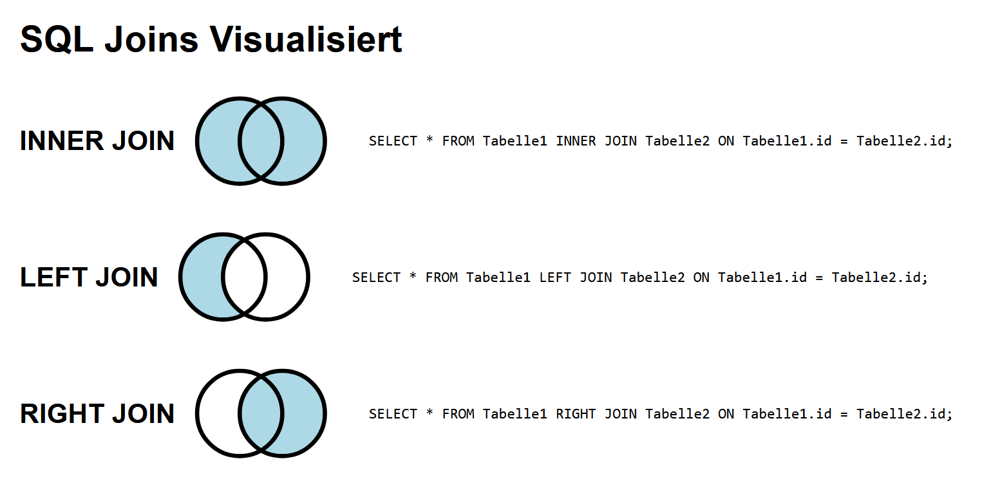

# Learning Website: Basics of SQL

This project is a simple website to help beginners understand the basics of SQL. The page demonstrates basic SQL queries and concepts in an interactive way.

## Preview

To see the full page, click on the link below:

[View Website](https://rawcdn.githack.com/KLubina/learning-website-basics-of-sql/18200ff7a90037f9f1782b7e12e9ddd38aa84a59/index.html)

## Screenshot

